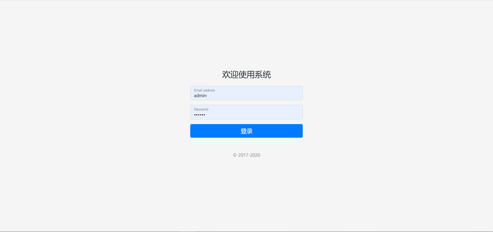
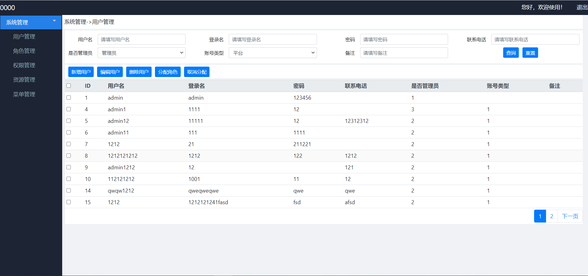

[前言](https://zhuanlan.zhihu.com/p/348214235)
<br>
[SpringSecurity技术介绍](https://zhuanlan.zhihu.com/p/348243780)

<br>

[如图片不显示去知乎专栏查看详细文档](https://zhuanlan.zhihu.com/p/348410020)

### 项目结构介绍

### 后台项目结构 vstore-project

> vstore-project （`后台服务端项目`）
> |-- vstore-boot
> |   |-- vstore-boot-autoconfigure （`springboot的通用配置，如权限，mybaits 等在这个抱配置`）
> |   |-- vstore-boot-starter（`springboot的通用配置，如权限，mybaits 等在这个抱配置`）
> |-- vstore-dependencies (`框架外部依赖`)
> |-- vstore-framework
> |   |-- vstore-framework-base (`框架通用代码`)
>
> |-- vstore-parent (`本项目的依赖包`)
>
> |-- vstore-web  (`WEB项目`)

> |-- main
> |   |-- java
> |   |   -- com
> |   |       -- vstore
> |   |           |-- Application.java `启动文件`
> |   |           |-- controller `控制层`
> |   |           |-- entity `实体层`
> |   |           |-- mapper `数据访问层`
> |   |           |-- service `服务层`
> |   |           -- vo `vo层`
> |   -- resources
> |       |-- application-jdbc.yml `jdbc配置`
> |       |-- application.yml `基础配置`
> |       |-- com
> |       |   -- vstore
> |       |       -- mapper	`mybaits xml 文件`
> |       |-- log4j2.xml

### 前台项目结构 vstore-ui

|-- src
|-- static	`静态资源`

|-- components `通用组件`
|   |-- From
|   |-- Head
|   |-- Left
|   |-- Table
|   |-- Toolbar
|   -- comm.jsx
|-- layouts `基础布局文件`
|   -- BasicLayout.jsx
|   -- BasicLayout.less
| -- pages `项目页面`
|     -- actions
|     -- index
|     -- login

|-- webpack.config.js `webpack 打包配置`

### 启动

> 下载代码，参考上面目录结构说明

**启动前台**

进入 vstore\vstore-ui 执行

```
yarn start
```

**启动后台**

1. 创建数据库和表结构，初始化数据，SQL文件在 vstore\doc\vstore.sql  目录下

2. 后台项目是一个springboot 项目，在idea 中执行main 方法就行

进入 vstore\vstore-project\vstore-web\src\main\java\com\vstore\Application.java 执行 main 方法

**配置nginx**

由于是一个前后端分离项目，需要配置一下nginx，nginx 配置文件如下

```
# 前台项目地址
upstream	store_ui{
	   server  127.0.0.1:8601  ;    
}

# 后台项目地址
upstream  store_web{
       server  127.0.0.1:8003    ;    
}

server {
	   listen      8004;		#服务访问地址
       server_name  localhost;
	   root	/;  #页面目录
       index index.html;
	   location  / {
            add_header Access-Control-Allow-Origin *;
            add_header Access-Control-Allow-Headers X-Requested-With,token;
            add_header Access-Control-Allow-Methods GET,POST,OPTIONS;
            proxy_pass_header Server;
            proxy_set_header Host $http_host;
            proxy_redirect off;
            proxy_connect_timeout 60s;
            proxy_read_timeout 5400s;
            proxy_send_timeout 5400s;
            proxy_set_header X-Real-IP $remote_addr;
            proxy_set_header X-Scheme $scheme;
            proxy_pass http://store_ui;
        }
		
		location  /vstore/loginAjax {
            add_header Access-Control-Allow-Origin *;
            add_header Access-Control-Allow-Headers X-Requested-With,token;
            add_header Access-Control-Allow-Methods GET,POST,OPTIONS;
            proxy_pass_header Server;
            proxy_set_header Host $http_host;
            proxy_redirect off;
            proxy_connect_timeout 60s;
            proxy_read_timeout 5400s;
            proxy_send_timeout 5400s;
            proxy_set_header X-Real-IP $remote_addr;
            proxy_set_header X-Scheme $scheme;
            proxy_pass http://store_ui/;
        }
		
	    location  /vstore {	
            add_header Access-Control-Allow-Origin *;
            add_header Access-Control-Allow-Headers X-Requested-With,token;
            add_header Access-Control-Allow-Methods GET,POST,OPTIONS;
            proxy_pass_header Server;
            proxy_set_header Host $http_host;
            proxy_redirect off;
            proxy_connect_timeout 60s;
            proxy_read_timeout 5400s;
            proxy_send_timeout 5400s;
            proxy_set_header X-Real-IP $remote_addr;
            proxy_set_header X-Scheme $scheme;
            proxy_pass http://store_web/vstore;
        }
}
```

前后台和nginx都启动之后，访问 http://127.0.0.1:8004/ 会出现登录页面




